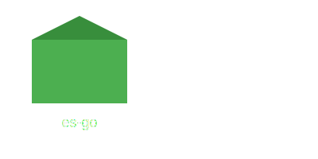

# es-go


[](https://goreportcard.com/report/github.com/pascalallen/es-go)




es-go is open source software offering a set of guidelines to use Event Sourcing and Domain-Driven Design in Go. 
This project is currently a work in progress and undergoing active development.

## Prerequisites

- [Docker](https://www.docker.com/)
- [Docker Compose](https://docs.docker.com/compose/)

## Development Environment Setup

### Clone Repository

```bash
cd <projects-parent-directory> && git clone https://github.com/pascalallen/es-go.git
```

### Copy & Modify `.env` File

```bash
cp .env.example .env
```

### Bring Up Environment

```bash
bin/up
``` 

### Take Down Environment

```bash
bin/down
```

## Contributing

Pull requests are welcome. For major changes, please open an issue first
to discuss what you would like to change.

Please make sure to update tests as appropriate.

## License

[MIT](LICENSE)
