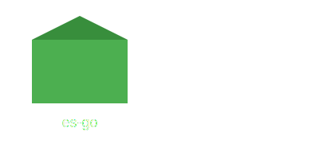

# es-go
#### Video Demo: https://youtu.be/Awd_VSUkUVo
#### Description:
es-go is open source software offering a set of guidelines to use Event Sourcing (ES), Command Query Responsibility Segregation (CQRS), and Domain-Driven Design (DDD) in Go. It uses EventStoreDB for event persistence and projections, and RabbitMQ for async command dispatch.


[](https://goreportcard.com/report/github.com/pascalallen/es-go)




## Prerequisites

- [Docker](https://www.docker.com/)
- [Docker Compose](https://docs.docker.com/compose/)

## Development Environment Setup

### Clone Repository

```bash
cd <projects-parent-directory> && git clone https://github.com/pascalallen/es-go.git
```

### Copy & Modify `.env` File

```bash
cp .env.example .env
```

### Bring Up Environment

```bash
bin/up
```

### Take Down Environment

```bash
bin/down
```

### Run Commands Inside the Container

All Go commands (build, test, etc.) run inside the `go` container via `bin/exec`:

```bash
bin/exec <command>
```

### Service UIs

| Service | URL |
|---|---|
| EventStoreDB | http://localhost:2113 |
| RabbitMQ | http://localhost:15672 |

## Architecture

### Patterns

| Pattern | Description |
|---|---|
| **Event Sourcing** | All state changes are stored as an immutable sequence of domain events. State is reconstructed by replaying those events. |
| **CQRS** | Commands (writes) flow async through RabbitMQ; queries (reads) are dispatched synchronously and rebuild state from events. |
| **DDD** | The `User` aggregate owns all invariants. External code never creates domain events directly — it calls aggregate methods. |

### Layers

```
cmd/es-go/           — entry point: wires container, registers commands/queries/projections, starts consumers
internal/es-go/
  domain/
    email/           — EmailAddress value object (validates RFC 5322 format)
    event/           — Event interface + all domain event structs (OccurredAt on every event)
    password/        — bcrypt Hash value type
    permission/      — Permission value type
    role/            — Role value type
    user/            — User aggregate (Register factory, UpdateEmailAddress, SetPassword, AssignRole, Delete)
  application/
    command/         — command structs (RegisterUser, UpdateUserEmailAddress, AssignRoleToUser, DeleteUser)
    command_handler/ — handlers: load aggregate → call method → AppendToStream with aggregate version
    query/           — query structs (GetUserById)
    query_handler/   — handlers: ReadFromStream → LoadUserFromEvents → return aggregate
    projection/      — EventStoreDB JS projection scripts (user-email-addresses unique constraint)
  infrastructure/
    messaging/       — RabbitMQ command bus (async) and synchronous query bus
    storage/         — EventStoreDB client (EventStore interface, EventStoreDb impl)
```

### CQRS + Event Sourcing flow

**Commands** (async via RabbitMQ):
1. `CommandBus.Execute` serializes the command and publishes it to the `commands` queue
2. `CommandBus.StartConsuming` deserializes and dispatches to the registered `CommandHandler`
3. The handler validates invariants (e.g., unique email via projection), then calls an aggregate method
4. The aggregate raises events into its `uncommittedEvents` slice (write path does not increment version)
5. The handler calls `EventStore.AppendToStream(streamId, u.Version(), u.UncommittedEvents())`
6. `AppendToStream` uses the aggregate's version for optimistic concurrency (`-1` → `NoStream`, `≥ 0` → `Revision(version)`)
7. Stream IDs follow the pattern `user-{ulid}`

**Queries** (synchronous):
1. `QueryBus.Fetch` dispatches directly to the registered `QueryHandler`
2. The handler calls `EventStore.ReadFromStream`, which returns all events for the stream
3. `user.LoadUserFromEvents` replays events to rebuild aggregate state; each applied event increments `version`

**Projections** (run inside EventStoreDB):
- Written as JavaScript and registered at startup via `EventStore.RegisterProjection`
- Listen to event categories and maintain queryable state
- Used for the `user-email-addresses` unique constraint

### Aggregate versioning and optimistic concurrency

`User.version` starts at `-1` (no events persisted). Each event applied during `LoadUserFromEvents` increments it. After loading N events, `version == N-1`, matching EventStoreDB's 0-based stream revision of the last persisted event.

On the write path, aggregate methods call the internal `raise()` helper which mutates state and queues the event but does **not** increment `version`. This means `u.Version()` always reflects the last **persisted** revision — the correct value to pass as `expectedVersion` to `AppendToStream`.

### Dependency injection

Uses [Google Wire](https://github.com/google/wire). `wire.go` is the injector (build-tagged `wireinject`); `wire_gen.go` is the generated output. Run `wire` inside the `cmd/es-go` directory to regenerate after modifying providers.

### Adding a new event type

New events require changes in these places:

1. Define the event struct in `internal/es-go/domain/event/user.go` with `EventName()` and `OccurredAt time.Time`
2. Add an `applyEventState` case in `domain/user/user.go`
3. Add a `case` in `EventStoreDb.ReadFromStream` (`infrastructure/storage/event_store.go`)
4. Add the corresponding aggregate method (or update an existing one) in `domain/user/user.go`
5. Add a `case` in `RabbitMqCommandBus.processCommand` (`infrastructure/messaging/command_bus.go`) if triggered by a new command
6. Register the command handler in `main.go`

### Environment variables

Copy `.env.example` to `.env`. Key variables consumed by the Go app:
- `EVENTSTORE_HOST`, `EVENTSTORE_HTTP_PORT` — EventStoreDB connection
- `RABBITMQ_HOST`, `RABBITMQ_PORT`, `RABBITMQ_DEFAULT_USER`, `RABBITMQ_DEFAULT_PASS` — RabbitMQ connection

EventStoreDB UI is available at `http://localhost:2113`; RabbitMQ management UI at `http://localhost:15672`.

## Testing

Run all tests:

```bash
bin/exec go test ./...
```

Run a single package's tests:

```bash
bin/exec go test github.com/pascalallen/es-go/internal/es-go/application/command/...
```

Run tests and generate a coverage profile:

```bash
bin/exec go test ./... -covermode=count -coverprofile=coverage.out
bin/exec go tool cover -html=coverage.out -o coverage.html
```

## Contributing

Pull requests are welcome. For major changes, please open an issue first
to discuss what you would like to change.

Please make sure to update tests as appropriate.

## License

[MIT](LICENSE)
